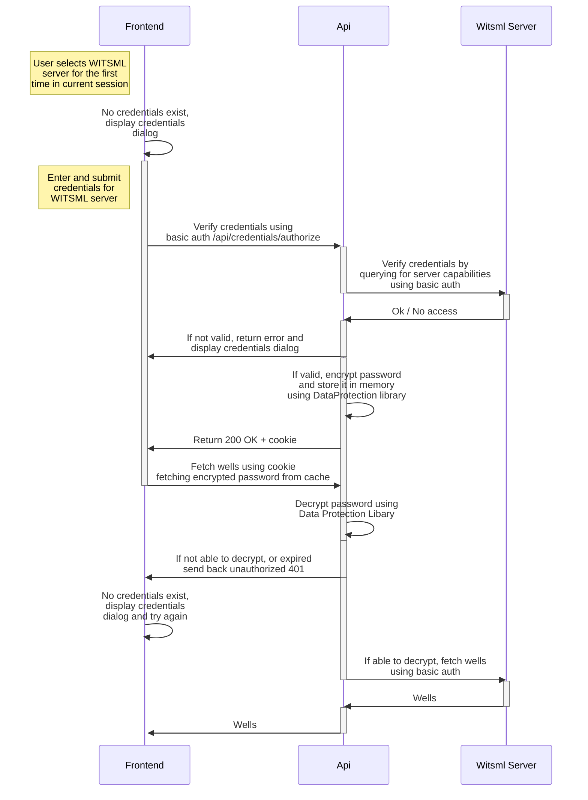
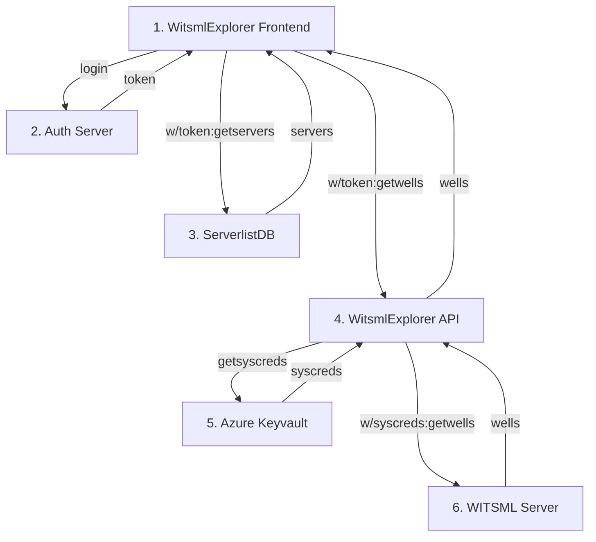

# Authentication and Authorization in WITSML Explorer
## WITSML server credentials flow (Basic)
Every request run against a WITSML server is run from the backend and needs to be authenticated.
Basic auth is required for a lot of WITSML servers, so that is currently the main way WE authenticates against them.

Most actions done by the user in WE involves fetching or writing data to external WITSML servers. All these requests require credentials to be provided to the `authorization` endpoint in advance.

It would be a very bad user experience if the user would have to provide credentials for every request to the API. 
Therefore an encrypted version of the passwords is saved in a memory-cache on the backend. The backend only stores them for a limited amount of time, and will provide them for every request involving WITSML servers. 

The backend has a [Data Protection](https://docs.microsoft.com/en-us/aspnet/core/security/data-protection/introduction) storage running in memory, which is used for encrypting the passwords as well as decrypting them (only possible on the running instance).

When a request is forwarded to the WITSML server, the backend will decrypt the password from the cache, and use it when running the request.

__To use the API without the frontend, the user needs to provide credentials in the header for `WitsmlTargetServer` on the `/credentials/authorize` route. The format is Basic Authorization format Base64 encoded along with server URL. See Swagger for more information on Header information. Subsequent requests will automatically reuse the credentials that were saved to the cache when calling the `/credentials/authorize` route. Examples are provided in the [API Access without frontend](#api-access-without-frontend) section of this document.__

This is a description of the flow:
### 1. When the user connects to a server for the first time
  - frontend contacts `authorize` endpoint with entered credentials along with server url
  - if this is a new client without any cookie and id, generate an id for this client
  - backend verifies credentials with the WITSML server, if OK, encrypts credentials, adds them to the cache and generates an unique cacheId based on client-id and server host
  - `TTL` before credentials are invalidated will be given by the query param `keep`
    - keep=true => 24 hours
    - keep=false or missing  => 1 hour
  - `[secure ,samesite=strict, httponly]` cookie is added to the response with uuid as value
  - **session cookie used**

### 2. Successive connections to API
  - frontend calls API with `WitsmlTargetServer` and (in copy-jobs) `WitsmlSourceServer` information
  - `[secure ,samesite=strict, httponly]` cookie is passed along with the request with id as value
  - backend uses uuid from cookie to lookup encrypted credentials in `CredentialsCache`
    - if no credentials exists, send response `401` . User will have to login to get a cookie with valid cache entry
  - **session cookie used**



## WITSML server credentials flow (OAuth2)
OAuth2 authorization code flow and system credentials fetched from keyvault can also be used for a simplified end user experience. Examples are outlined below for Azure AD and Azure keyvault.

User will log in by Equinor tenant. 

### 1. When the user connects to a server for the first time

#### OAuth mode with system credentials access based on app role assignment
  - backend uses claim sub in Bearer token for user-to-app identification
  - backend fetches credentials from keyvault, encrypts and stores the credentials in the backend cache identified by information in id_token (sub)
  - **TTL** before credentials are invalidated will be given by the query param `keep`
    - keep=true => 24 hours
    - keep=false or missing  => 1 hour
  - **no cookies involved**

#### OAuth mode not assigned the necessary role to use system creds from keyvault
  - frontend contacts authorize endpoint the same manner as in Basic mode
  - backend uses Bearer token sub for user identification
  - **no cookies involved**
### 2. Successive connections to API
  - frontend calls API with WitsmlTargetServer and (in copy-jobs) WitsmlSourceServer information
  - backend uses sub from Bearer token to lookup encrypted credentials in CredentialsCache
    - if no credentials exists, send response 401 and display the credentials modal
  - **no cookies involved**

## Swagger
When developing, visit `https://localhost:5001/swagger/index.html` to examine endpoints and authentication schemes. Setup will be outlined below.

### Basic authentication
The `WitsmlServerHandler` at `/api/witsml-servers` endpoint can be used to get a list of witsml servers in json format without any credentials.

`Basic` authentication is available by default and `username`/`password` should first be used to get an encrypted password from the `AuthorizationHandler` `/api/authorize` endpoint along with information about the server as json in the body.

After aquiring this token, you should use the authorize button again (Basic), but this time with your `username`/`encrypted password`. The encrypted password received from the authorizationhandler.

Entering this in swagger the Authorization/BasicAuth fields will make sure to include the `Authorization: Basic ...` header in your successive calls to other endpoints. The header value `WitsmlTargetServer` for the same server you got the token also needs to be filled out as the credentials are valid only for a specific server.

### OAuth2 authentication
`OAuth2` authentication is turned off by default both in backend and frontend through the appsettings property `OAuth2Enabled`. For information about OAuth2 authorization code flow see: [auth code flow](https://learn.microsoft.com/en-us/azure/active-directory/develop/v2-oauth2-auth-code-flow)

If you want to add this flow to SwaggerUI, you need to customize the following info matching your own Azure app registration in the `mysettings.json` file. For information about app registrations and app roles setup see []()

**example `mysettings.json` file:**

```json
    "OAuth2Enabled": true,
    "AzureAd": {
        "AppName": "witsml-explorer-api",
        "Instance": "https://login.microsoftonline.com/",
        "TenantId": "b3edbf8f-e8b2-4c4e-96fc-c86cdd7fd55f",
        "ClientId": "109e12e2-4ca7-48d0-af05-c834c88ff22c",
        "PolicyRoles": [  "admin", "developer", "employee" ],
        "TokenValidationParameters": {
            "ValidateAudience": false,
            "ValidateIssuerSigningKey": true,
            "ValidateTokenReplay": true
        },
        "Swagger": {
            "AppName": "witsml-explorer-swaggerui",
            "AuthorizationUrl": "https://login.microsoftonline.com/b3edbf8f-e8b2-4c4e-96fc-c86cdd7ed55f/oauth2/v2.0/authorize",
            "TokenUrl": "https://login.microsoftonline.com/b3edbf8f-e8b2-4c4e-96fc-c86cdd7ed55f/oauth2/v2.0/token",
            "ClientId": "5abc9bc0-3ecb-423b-8457-da3c017c547a",
            "Scopes": "api://a10111dc-712d-485f-8600-57be8c597921/access_as_user",
        },
        "KVWitsmlServerCreds": "witsmlexp-servers-kv",
    }
``` 

By enabling the `"OAuth2Enabled": true,` setting, you should now find a new entry: `AuthorizationCode with PKCE` available in the Swagger UI.

All endpoints will now need a logged in user, authenticated by your tenant.

### System credentials

System credentials for a server can be included through a `secrets.json` file or in Azure keyvault:

**secrets.json format**
```json
"WitsmlCreds": {
    "prod":  { "Host": "https://url1", "UserId": "user1", "Password": "pw1" },
    "test":  { "Host": "https://url2", "UserId": "user2", "Password": "pw2" }
}    
```

To use Azure keyvault, create your keyvault (above named `witsmlexp-servers-kv`) and enter your system credentials as secrets in the following format to be included and automatically cached at api startup.

**example keyvault entries**


| Name         | Type      | Status   | Expiration date |
|--------------|-----------|------------|------------|
| witsmlcreds--prod--host | My server1 prod [R]      |         ||
| witsmlcreds--prod--password | My server1 prod [R]      |         ||
| witsmlcreds--prod--userid | My server1 prod [R]      |         ||
| witsmlcreds--test--host | My server2 test [CRUD]      |         ||
| witsmlcreds--test--password | My server2 test [CRUD]      |         ||
| witsmlcreds--test--userid | My server2 test [CRUD]      |         ||

 
## Serverlist

Credentials will be mapped on URL from secrets with the serverlist. `Server` entry in MongoDB or CosmosDB will have property `securityscheme` that can be `Basic` or `OAuth2`

The app role assigned to a server will be compared to the role claims in the JWT provided in the Authorization header. If a user has been assigned the same application role, system credentials will be applied to the connection.

For more info on app roles, see: [app roles](https://learn.microsoft.com/en-us/azure/active-directory/develop/howto-add-app-roles-in-azure-ad-apps)

**example server json in list**
```json
{
    "name": "Equinor WITSML",
    "url": "https://witsml007.someserver/store/WITSML",
    "description": "Equinor testserver. Do not edit any datasets",
    "securityScheme": "OAuth2",
    "role": [ "user" ]
}
```

**example JWT from Bearer token**
```json
  "roles": [
    "developer",
    "admin",
    "user"
  ]
```

## MSAL Frontend
To enable Oauth2 with MSAL in frontend, the following environment settings can be set:
```bash
# To disable MSAL, leave NEXT_PUBLIC_MSALENABLED empty
NEXT_PUBLIC_MSALENABLED=
NEXT_PUBLIC_AZURE_AD_TENANT_ID=
NEXT_PUBLIC_AZURE_AD_CLIENT_ID=
NEXT_PUBLIC_AZURE_AD_URL_WITSMLEXPLORER=http://localhost:3000/
NEXT_PUBLIC_AZURE_AD_SCOPE_API=

```

## Hybrid Flow
It is now possible to utilize both OAuth2 and Basic authentication security schemes at the same time. With this configuration the end user will have to authenticate against an authorization server that supports `OAuth2 Authorization Code Flow with PKCE`.

As described in the serverlist, Witsml-Explorer will choose the correct method to contact the backend, based on how you configure your list of servers. If the Server has securityscheme `OAuth2` and both the server and user have the same `app-roles`, the frontend will use the `Bearer` token received from the authorization server and relay this to the backend along with the url of the server. It will not ask the user for basic credentials (username:password).

The backend in turn will do a lookup on the users application role, and if eligible, use the `system-user` fetched from `keyvault` for further connections to the WITSML server.

### Basic witsmlexplorer flow
For an illustration of sequences initiated when the user queries a server with property securityscheme set to `Basic`, visit the figure in the beginning of this document under `WITSML server credentials flow`

### OAuth2 witsmlexplorer flow with MSAL
The following diagram illustrates the flow for a user contacting a `Server` that have been assigned securityscheme `OAuth2`. The setting `OAuth2Enabled=true` has been set in backend, and MSAL enabled in frontend:




1. End user visits Witsml-Explorer.
2. The end user will be redirected to login with the configured OAuth2 Authorization server (Azure AD).
3. Witsml-Explorer will fetch the initial Serverlist from DB. When OAuth2 is enabled both in the frontend and backend, retrieving the serverlist will only be available for logged in users. Similarly Create, Update and Delete will be reserved for users with role `admin`. All servers in the list now include two properties: `securityscheme` and `role`.
4. If the user through the frontend chooses to query a server with a `securityscheme` set to `OAuth2`, the backend will check the received `Bearer` JWT token for `app-roles`. This in turn will be checked against the configured `roles` for the server.
5. When one of the user roles and server roles overlap, the backend fetches system credentials from `Azure Keyvault` for this witsml server.
6. The server will now forward the query to the witsml server using `Basic` authorization with system credentials fetched from step 5.

The resulting list of wells will then be passed back to the frontend.

## API Access without frontend

Below are some examples on the use of API endpoints without the frontend. See information about `Swagger` and `Swashbuckle` earlier in the documents for detailed information on the endpoints

### Basic mode

`witsml-explorer` is in `Basic` mode. (Started with `OAuth2Enabled=false` in appsettings).

__1. Get witsml-server configuration list__ and cookie. You will need to include this cookie to subsequent calls to the API

```http
GET http://localhost:5000/api/witsml-servers HTTP/1.1
Host: localhost:5000
Content-Type: application/json
Origin: http://localhost:3000
```
```http
HTTP/1.1 200 OK
Set-Cookie: witsmlexplorer=9a8c9c5d-1d0c-4ebf-867d-6641962da380; path=/; secure; samesite=strict; httponly
```

__2. Authorize WITSML credentials__ for the WITSML server you will query, this to ensure that backend encrypts the password and caches it against your session. 

```http
GET http://localhost:5000/api/credentials/authorize?keep=false HTTP/1.1
Host: localhost:5000
Content-Type: application/json
Origin: http://localhost:3000
Cookie: witsmlexplorer=9a8c9c5d-1d0c-4ebf-867d-6641962da380
WitsmlTargetServer: dXNlcjEyMzpwYXNzNDU2@https://witsmlserver.using.basic.creds/Store/WITSML
```
```http
HTTP/1.1 200 OK
Content-Length: 0
Connection: close
Date: Tue, 22 Nov 2022 21:03:00 GMT
Server: Kestrel
Access-Control-Allow-Credentials: true
Access-Control-Allow-Origin: http://localhost:3000
```

__3. Use endpoints__  
Include cookie. If credentials has expired or missing you will get a `401` response and will need to authorize (step 2) again first

```http
GET http://localhost:5000/api/wells HTTP/1.1
Host: localhost:5000
Content-Type: application/json
Origin: http://localhost:3000
Cookie: witsmlexplorer=9a8c9c5d-1d0c-4ebf-867d-6641962da380
WitsmlTargetServer: https://witsmlserver.using.basic.creds/Store/WITSML
```
```http
HTTP/1.1 200 OK
Connection: close
Content-Type: application/json; charset=utf-8
Date: Tue, 22 Nov 2022 20:53:03 GMT
Server: Kestrel
Transfer-Encoding: chunked

[
  {
    "uid": "8b6b40ca-fcf5-4f4c-83ff-91a9f358c30b",
    "name": "_ Complete",
    "field": "Greenfield",
    "timeZone": "+01:00",
    "operator": "Equinor",
...
...
```

### OAuth2 mode

`witsml-explorer` is in `OAuth2` mode. (Started with `OAuth2Enabled=true` in appsettings).

No cookie involved. But you will still need to authorize for servers configured as `Basic`.

**Prerequisite**: a valid `Bearer` token with app-roles and server configuration in place.

__1. witsml-server configuration list__ (and other endpoints)
```http
GET https://localhost:5001/api/witsml-servers HTTP/1.1
Content-Type: application/json
Authorization: Bearer eyJ...<token here>
```

If a server has system credentials in keyvault and the bearer of the token has the correct `role` for this server, you can use endpoints directly. Example below for rigs

__2. Use endpoints__ 
```http
GET http://localhost:5000/api/wells/<wellId>/wellbores/<wellboreId>/rigs HTTP/1.1
Authorization: Bearer eyJ...<token here>
Content-Type: application/json
WitsmlTargetServer: https://witsmlserver.using.system.creds/store/WITSML
```

If you do not have system credentials in keyvault, and need to use Basic credentials for a server in OAuth2 mode, you must `authorize` first like below before using endpoints with this server.

__3. Authorize WITSML credentials__ 
```http
GET http://localhost:5000/api/credentials/authorize?keep=false HTTP/1.1
Authorization: Bearer eyJ...<token here>
Host: localhost:5000
Content-Type: application/json
Origin: http://localhost:3000
WitsmlTargetServer: dXNlcjEyMzpwYXNzNDU2@https://witsmlserver.using.basic.creds/Store/WITSML
```
(note the base64 encoded `username:password` @ witsmlserver)
