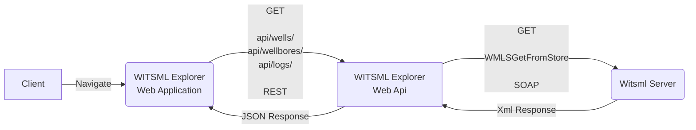
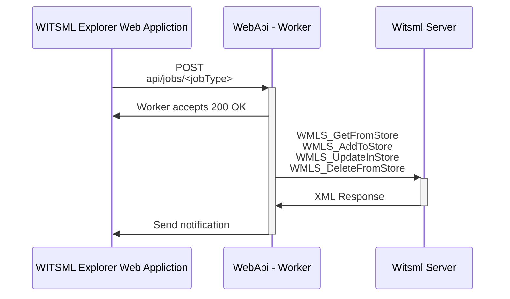

# Contributing to WITSML Explorer
The goal is to make a tool that will fulfill most of the needs regarding managing data on WITSML servers. 
A good data management tool will simplify the process of improving data quality, which often is generally poor and limits the applications for using the data.
By opening the source code we can do this together with other organizations and individuals, and hopefully create a tool that can be used by everyone who need to browse and edit data on WITSML servers. 

WITSML Explorer (WE) is still in its infant days, and there is a lot of features and improvements to be made.
Contributions are welcome and greatly appreciated :clap:

## What kind of contributions do we need
There are two levels of issues - userstory and issue

### Userstory
A userstory is describing a functional (high level) enhancement of the WitsmlExplorer. 
Proposals for new user stories are submitted as new issue - [use the Userstory template](https://github.com/equinor/witsml-explorer/issues/new/choose).

### Issues
Issues are the feature (code level) enhancement of WitsmlExplorer. Here is the [issue list](https://github.com/equinor/witsml-explorer/issues) and project board for [proposed and ongoing issues](https://github.com/orgs/equinor/projects/789).  
Feel free to file new issues for bugs, suggest feature requests or improvements and so on. Please relate the issue to an UserStory if possible.

If you wish to contribute with coding please have a look at our [Issues board](https://github.com/orgs/equinor/projects/789).
Issues that are in the TODO column should be ready to go, assign it to yourself and start working on it :computer:
Especially the ones labeled as a `good first issue` might be a good start. 
Other issues might need some discussion or clarification before it can be started on, give us your thoughts or suggestions on something you would like to work on, and we can take it from there :smiley: 

## Contribution process
We use a [fork and pull request workflow](https://github.com/susam/gitpr). Fork the repo, and get going!

Templates for both issues and pull requests are used. They both provide a check list that indicates what we hope to see present.
Not all checkpoints will be applicable for all issues/PRs, but checking of as many boxes as possible is a good start.

When a PR is opened, a CI job will be run to verify that everything is being built, tested and linted properly.

After the CI job is passed, a review will be done. A maintainer will merge the PR when all is good :thumbsup:

### Reviewing
If you are reviewing a pull request, please follow the [guidelines](https://github.com/equinor/witsml-explorer/blob/main/PR_REVIEW_CHECKLIST.md).

## Set up development environment
After forking the repo to your own github account, do the following:
```
# Clone the repo
git clone git@github.com:<yourgithubaccount>/witsml-explorer.git

# Step into local repo
cd witsml-explorer

# Create your own local mysettings.json file (not to be tracked in git)
cd Src/WitsmlExplorer.Api/
cp appsettings.json mysettings.json
```

### Database for storing urls to WitsmlServers

Using [MongoDB](Docker/MongoDb/README.md), [CosmosDB](Scripts/Azure/README.md) or [LiteDB](#using-litedb)

### Using LiteDb

LiteDb is a serverless database stored in a single file. To use LiteDb, add this to the configuration in `mysettings.json`:
```json
{
  "LiteDb": {
    "Name": "witsml-explorer-db.db"
  }
}
```
Note that the name should contain the .db extension. It can be a full path to the database file if you want to store it in a different folder.

## Running
The database, backend and frontend must be running at the same time for WE to work properly.

### Backend WitsmlExplorer.Api

Change the configuration in `mysettings.json` to the following, so that the backend will be able to connect to our new database:
```
{
  "LogQueries": false,
  "AllowedHosts": "*",
  "AllowedOrigin": "http://localhost:3000",
  "MongoDb": {
    "Name": "witsml-explorer-db",
    "ConnectionString": "mongodb://<username>:<password>@localhost"
  }
},
```
`<username>` and `<password>` are what was configured in the docker-compose.yml file.

```
cd Src/WitsmlExplorer.Api/
# Download dependencies and build project
dotnet build
# Run the backend
dotnet run
```
In folder `Src/WitsmlExplorer.Api/` run `dotnet build`  and `dotnet run`

### Frontend WitsmlExplorer.Frontend
```
cd Src/WitsmlExplorer.Frontend/
# Download dependencies
yarn
# Run the frontend
yarn dev
```
You should now find WitsmlExplorer running on `localhost:3000` in your browser. Ensure that frontend, backend and database are running. 

### Swashbuckle 
In developer environment, [Swashbuckle](https://docs.microsoft.com/en-us/aspnet/core/tutorials/getting-started-with-swashbuckle?view=aspnetcore-6.0&tabs=visual-studio-code) should make `SwaggerUI` available at the local url: `http(s)://localhost:<port>/swagger`. 

The generated document at `/swagger/v1/swagger.json` describing the endpoints appears as shown in OpenAPI specification [openapi.json](https://learn.microsoft.com/en-us/aspnet/core/tutorials/web-api-help-pages-using-swagger?view=aspnetcore-6.0#openapi-specification-openapijson).

## Testing

### Frontend
```
# From project root
cd Src/WitsmlExplorer.Frontend
yarn test
```

### Backend

#### Unit tests
```
# From the project root
cd Tests/WitsmlExplorer.Api.Tests
dotnet test
```

#### Integration tests
The purpose of these tests has been to test workers and integrations directly against WITSML servers. They are by default skipped, and not part of the test suite that is run during the CI pipeline.  

You will need a secrets file for keeping the credentials for the server you wish to run the tests against:
```
# From the project root
cd Tests/WitsmlExplorer.IntegrationTests
# Create a JSON file for WITSML server secrets
touch secrets.json
```
The file should contain these fields if running tests against a given WITSML server:
```json
{
  "Witsml": {
    "Host": "<witsml server url>",
    "Username": "<username>",
    "Password": "<password>"
  }
}
```

For a more secure alternative handling the credentials, you can make use of `dotnet user-secrets` to handle the fields:
```
# From the project root
cd Tests/WitsmlExplorer.IntegrationTests

# Initialize 'UserSecretsId' for this project if not done previously
dotnet user-secrets init

# Add fields
dotnet user-secrets set "Witsml:Host" "<url>"
dotnet user-secrets set "Witsml:Username" "<username>"
dotnet user-secrets set "Witsml:Password" "<password>"
```

A db configuration is needed if running tests that uses the database (**NB** Use same name as in mySettings.json) :
MongoDB:
```json
{
  "MongoDb": {
    "Name": "witsml-explorer-db",
    "ConnectionString": "mongodb://<username>:<password>@localhost"
  }
}
```
LiteDB:
```json
{
  "LiteDb": {
    "Name": "witsml-explorer-db.db"
  }
}
```

To run a given test, open the test file that contains it and remove the `Skip` part. E.g replace
``` c#
[Fact(Skip = "Should only be run manually")]
```
with
``` c#
[Fact]
```

Then run
```
dotnet test
```

## Code style guidelines
We use some tools to help us keep the code style as consistent as possible. Automated checks are ran when a PR is opened. The build will break if these rules are not enforced.

### VSCode, settings and editorconfig
If using VSCode, the settings included in `.vscode/settings.json` will enforce some formatting, and provide code-analysis based on rules added to `.editorconfig`

### Prettier [](https://github.com/prettier/prettier)
In our frontend project we use the opinionated code formatter [Prettier](https://prettier.io/). Most of the rules applied are the default, but some changes can be found in `.prettierrc`.
Most IDEs have plugins that support Prettier. This will make the result of formatting code in your IDE be consistent with running prettier manually. 

### ESLint
For linting our frontend code we use [ESLint](https://github.com/typescript-eslint/typescript-eslint) and Prettier as a husky trigger.

### dotnet-format
For our non frontend code, we use [dotnet-format](https://github.com/dotnet/format) for validating and fixing code that does not follow the project rules. They can be found in `.editorconfig` at the project root.

### Run checks as a pre-commit hook
We use [Husky](https://github.com/typicode/husky) to run `ESLint`, `Prettier` and `dotnet-format` as pre commit hooks. This will give errors when creating commits that causes checks to fail.
To ensure you have the husky trigger installed, please run `yarn install` in root folder once.

## Project overview
Here you will get a brief overview of the system flow and project structure.

### Project structure summary
This solution consists of 4 projects:
* Witsml
  * Contains domain objects which maps to the XML structure from a Witsml server. It also contains functionality to build queries for a set of Witsml objects (well, wellbore, rig, log).
* WitsmlExplorer.Api
  * Api used by the frontend application. Every request from the frontend will be handled here. Receive job descriptions and spawn workers for every writing operations done on a witsml server.
* WitsmlExplorer.Console
  * Console application to be used without web GUI
* WitsmlExplorer.Frontend
  * Frontend web application which is what the user sees and interacts with.


### Simplified flow
This diagram gives a quick overview over the application components and flows.

Get data


Worker / jobs


Old Chart:


* When the user navigates in the web application, WITSML data is retrieved.
* When the user adds/updates/deletes, a job is made and a worker is triggered asynchronously on the backend.
* After a worker has finished, the result message will be pushed to the client, and a refresh is triggered if necessary.

### Generating service references
_Note that this only documents how it was done. It is not necessary to repeat this until incorporating changes to wsdl_.
Install `dotnet-svcutil`: `dotnet tool install --global dotnet-svcutil`

`ServiceReference` is generated by executing (in project folder): `dotnet-svcutil ../../Resources/Wsdl/witsml_v1.4.0_api.wsdl --namespace "*,Witsml.ServiceReference" --outputFile WitsmlService`

### IIS Deploy WitsmlExplorer
Assuming, we are planning deploy frontend at https://localhost/witsmlexplorer and backend at https://localhost/witsmlexplorerbackend

#### Deploy Backend
Publish WitsmlExplorer.Api project to a folder. Eg.: C:\WE_Backend
```
	dotnet publish WitsmlExplorer.Api.csproj --output C:\WE_Backend
```	
Add Application under Default Web Site of IIS Manager

	-	select above output folder as Physical path (C:\WE_Backend)
	-	set Alias as 'witsmlexplorerbackend'
	
Do IIS restart

Verify successful deployment by accessing the url in browser or postman; Expect list of servers
		https://localhost/witsmlexplorerbackend/api/witsml-servers
		
#### Deploy Frontend
Edit .env.local file in WitsmlExplorer.Frontend project and set this value
```
	VITE_WITSMLEXPLORER_API_URL=https://localhost/witsmlexplorerbackend
```

Build and export the application to a folder. Eg.: C:\WE_Frontend
```
	npm run build
	npx next export -o C:\WE_Frontend
```
Add Application under Default Web Site of IIS Manager

	-	select above output folder as Physical path (C:\WE_Frontend)
	-	set Alias as 'witsmlexplorer'
	
Do IIS restart

Verify successful deployment by accessing the url in browser; Expect WE to work as expected
		https://localhost/witsmlexplorer
