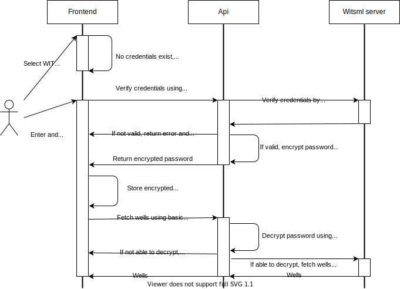

# Contributing to WITSML Explorer
The goal is to make a tool that will fulfill most of the needs regarding managing data on WITSML servers. 
A good data management tool will simplify the process of improving data quality, which often is generally poor and limits the applications for using the data.
By opening the source code we can do this together with other organizations and individuals, and hopefully create a tool that can be used by everyone who need to browse and edit data on WITSML servers. 

WITSML Explorer (WE) is still in its infant days, and there is a lot of features and improvements to be made.
Contributions are welcome and greatly appreciated :clap:

## What kind of contributions do we need
There are two levels of issues - userstory and issue

### Userstory
A userstory is describing a functional (high level) enhancement of the WitsmlExplorer. 
Here is the project board of [proposed and ongoing userstories](https://github.com/equinor/witsml-explorer/projects/2), and here is an [overview of the main contributors](https://github.com/equinor/witsml-explorer/wiki/Backlow-Overview) participating on each userstory.
Proposals for new user stories are submitted as new issue - [use the Userstory template](https://github.com/equinor/witsml-explorer/issues/new/choose) .

### Issues
Issues are the feature (code level) enhancement of WitsmlExplorer. Here is the project board for [proposed and ongoing issues](https://github.com/equinor/witsml-explorer/projects/1).  
Feel free to file new issues for bugs, suggest feature requests or improvements and so on. Please relate the issue to an UserStory if possible.

If you wish to contribute with coding please have a look at our [Issues board](https://github.com/equinor/witsml-explorer/projects/1).
Issues that are in the TODO column should be ready to go, assign it to yourself and start working on it :computer:
Especially the ones labeled as a `good first issue` might be a good start. 
Other issues might need some discussion or clarification before it can be started on, give us your thoughts or suggestions on something you would like to work on, and we can take it from there :smiley: 

## Contribution process
We use a [fork and pull request workflow](https://github.com/susam/gitpr). Fork the repo, and get going!

Templates for both issues and pull requests are used. They both provide a check list that indicates what we hope to see present.
Not all checkpoints will be applicable for all issues/PRs, but checking of as many boxes as possible is a good start.

When a PR is opened, a CI job will be run to verify that everything is being built, tested and linted properly.

After the CI job is passed, a review will be done. A maintainer will merge the PR when all is good :thumbsup:

## Set up development environment
After forking the repo to your own github account, do the following:
```
# Clone the repo
git clone git@github.com:<yourgithubaccount>/witsml-explorer.git

# Step into local repo
cd witsml-explorer

# Create your own local mysettings.json file (not to be tracked in git)
cd Src/WitsmlExplorer.Api/
cp appsettings.json mysettings.json
```

### Using MongoDB for storing urls to WitsmlServers
_Note: WE also supports Cosmos DB, but that requires a little more setup, see the [CosmosDB setup guide](#Cosmos-database)._

To quickly get a development database up and running, a MongoDB docker image can be used. 
```
# From the project root, cd to
cd Docker/MongoDb
```
Add an initial db username and password by editing the `docker-compose.yml` file and setting `MONGO_INITDB_ROOT_USERNAME` and `MONGO_INITDB_ROOT_PASSWORD` (no space after `=`).
```
# Pull and run a default MongoDB locally
docker-compose up -d
```
The default is to mount a volume in the same directory, but that can be changed in the `docker-compose.yml` file based on your preference. After execution `docker-compose up -d `, once, you can reset docker-compose.yml as the environment settings only is required the first time you run your mongoDb.

Change the configuration in `mysettings.json` to the following, so that the backend will be able to connect to our new database:
```
{
  "LogQueries": false,
  "AllowedHosts": "*",
  "Host": "http://localhost",
  "MongoDb": {
    "Name": "witsml-explorer-db",
    "ConnectionString": "mongodb://<username>:<password>@localhost"
  }
},
```
`<username>` and `<password>` is what was configured in the docker-compose.yml file.

#### Populate list of WITSML servers
The list of WITSML servers a user can connect to is currently not editable by the user itself (feature is disabled until proper authorization is implemented).
There exists some integration tests that can be run for this purpose, but first you need to add a file `secrets.json` in the integration test folder `WitsmlExplorer.IntegrationTests`. Include following into `secrets.json` (**NB** Use same name as in mySettings.json):
```
{
"MongoDb": {
  "Name": "witsml-explorer-db",
  "ConnectionString": "mongodb://<username>:<password>@localhost"
  }
}
```
`<username>` and `<password>` is what was configured in the docker-compose.yml file.

In the file `WitsmlExplorer.IntegrationTests/Api/Repositories/MongoDbRepositoryTests.cs` you shall use the test AddServer(). First remove `(Skip="Should only be run manually")` from the `[Fact]` just above the AddServer() test.
Then update with details for your specific server:
```
var newServer = new Server
            {
                Name = "<insert servername>",
                Url = new Uri("<insert url>"),
                Description = ""
            };
```
Then run the test from the commandline `dotnet test` or from your IDE. The server is now added to your mongoDB. Repeat this for all your servers.
After adding your servers, reset file `MongoDbRepositoryTests.cs`.

## Running
The database, backend and frontend must be running at the same time for WE to work properly.

### Backend
```
cd Src/WitsmlExplorer.Api/
# Download dependencies and build project
dotnet build
# Run the backend
dotnet run
```
In folder `Src/WitsmlExplorer.Api/` run `dotnet build`  and `dotnet run`

### Frontend
```
cd Src/WitsmlExplorer.Frontend/
# Download dependencies
yarn
# Run the frontend
yarn dev
```
You should now find WitsmlExplorer running on `localhost:3000` in your browser. Ensure that frontend, backend and database are running. 

## Testing

### Frontend
```
# From project root
cd Src/WitsmlExplorer.Frontend
yarn test
```

### Backend

#### Unit tests
```
# From the project root
cd Tests/WitsmlExplorer.Api.Tests
dotnet test
```

#### Integration tests
The purpose of these tests has been to test workers and integrations directly against WITSML servers. They are by default skipped, and not part of the test suite that is run during the CI pipeline.  

You will need a secrets file for keeping the credentials for the server you wish to run the tests against:
```
# From the project root
cd Tests/WitsmlExplorer.IntegrationTests
# Create a JSON file for WITSML server secrets
touch secrets.json
```
The file should contain these fields if running tests against a given WITSML server:
```json
{
  "Witsml": {
    "Host": "<witsml server url>",
    "Username": "<username>",
    "Password": "<password>"
  }
}
```

For a more secure alternative handling the credentials, you can make use of `dotnet user-secrets` to handle the fields:
```
# From the project root
cd Tests/WitsmlExplorer.IntegrationTests

# Initialize 'UserSecretsId' for this project if not done previously
dotnet user-secrets init

# Add fields
dotnet user-secrets set "Witsml:Host" "<url>"
dotnet user-secrets set "Witsml:Username" "<username>"
dotnet user-secrets set "Witsml:Password" "<password>"
```

A db configuration is needed if running tests that uses the database (**NB** Use same name as in mySettings.json) :
```json
{
  "MongoDb": {
    "Name": "witsml-explorer-db",
    "ConnectionString": "mongodb://<username>:<password>@localhost"
  }
}
```

To run a given test, open the test file that contains it and remove the `Skip` part. E.g replace
``` c#
[Fact(Skip = "Should only be run manually")]
```
with
``` c#
[Fact]
```

Then run
```
dotnet test
```

## Code style guidelines
We use some tools to help us keep the code style as consistent as possible. Automated checks are ran when a PR is opened. The build will break if these rules are not enforced.

### Prettier [](https://github.com/prettier/prettier)
In our frontend project we use the opinionated code formatter [Prettier](https://prettier.io/). Most of the rules applied are the default, but some changes can be found in `.prettierrc`.
Most IDEs have plugins that support Prettier. This will make the result of formatting code in your IDE be consistent with running prettier manually. 

### ESLint
For linting our frontend code we use [ESLint](https://github.com/typescript-eslint/typescript-eslint).

### ECLint
For our non frontend code, we use [ECLint](https://github.com/jedmao/eclint) for validating and fixing code that does not follow the project rules. They can be found in `.editorconfig` at the project root.

### Run checks as a pre-commit hook
We use [Husky](https://github.com/typicode/husky) to run `ESLint` and `ECLint` as pre commit hooks. This will give errors when creating commits that causes checks to fail.

## Project overview
Here you will get a brief overview of the system flow and project structure.

### Project structure summary
This solution consists of 3 projects:
* Witsml
  * Contains domain objects which maps to the XML structure from a Witsml server. It also contains functionality to build queries for a set of Witsml objects (well, wellbore, rig, log).
* WitsmlExplorer.Api
  * Api used by the frontend application. Every request from the frontend will be handled here. Receive job descriptions and spawn workers for every writing operations done on a witsml server.
* WitsmlExplorer.Frontend
  * Frontend web application which is what the user sees and interacts with.

### Simplified flow
This diagram gives a quick overview over the application components and flows.


* When the user navigates in the web application, WITSML data is retrieved.
* When the user adds/updates/deletes, a job is made and a worker is triggered asynchronously on the backend.
* After a worker has finished, the result message will be pushed to the client, and a refresh is triggered if necessary.

### WITSML server credentials flow
Every request run against a WITSML server is run from the backend and needs to be authenticated.
Basic auth is required for a lot of servers, so that is currently the only way WE authenticate against them.

Most actions done by the user in WE involves fetching or writing data to external WITSML servers. All these requests require credentials to be provided. 
It would be a very bad user experience if the user would have to provide credentials for every request. 
Therefore an encrypted version of the passwords is saved both on the frontend and backend.
The webapp only stores them for a limited amount of time, and will provide them for every request involving WITSML servers. 
The backend has a [Data Protection](https://docs.microsoft.com/en-us/aspnet/core/security/data-protection/introduction) storage running in memory, which is used for creating the encrypted passwords as well as decrypting them (only possible for that running instance).
Whenever a request is run towards a WITSML server, the backend will decrypt the password, and use it when running the request against the given WITSML server.

This is how the flow is when a user has selected a server and will need to authenticate against it. After this is done, a fresh list of wells is fetched.  


## Additional information 
### Cosmos database
Witsml Explorer requires a database to store application data. One option is to use a Cosmos database in Azure.

#### Setting up a database in Azure 
1) If not already installed, install Azure CLI on your computer [Azure CLI](https://docs.microsoft.com/en-us/cli/azure/?view=azure-cli-latest), and then login `az login`
2) Copy `config-example.cfg` into a new file `config.cfg` in folder `Scripts/Azure` and fill in `subscriptionId` and `resourceGroupName` from your Azure subscription and resourcegroup.
3) There exist some scripts  that may simplify setting up the necessary infrastructure for this project in folder `Scripts/Azure`. 
<br>Script to create Cosmos DB: ```./create-cosmos-db.sh```
<br>Script to run all together: ```./run-azure-scripts.sh```
4) In file `config.cfg` enter `databaseAccountName` and a name (container) for your database in `databaseName`.  
5) Run ```./create-cosmos-db.sh``` (prerequisite azure cli installed, and that your are logged in)

#### Configure backend to use CosmosDB
If you have a CosmosDB setup and ready, follow these steps to configure the backend properly.
```
#From project root.
cd Src/WitsmlExplorer.Api
# If you do not have a mysettings.json file, create it:
cp appsettings.json mysettings.json 
``` 
Add the following `"CosmosDb"` configuration to `mysettings.json`
```
{
  {...},
  "CosmosDb": {
    "Uri": "<...>", (Uri from relevant Azure Database => Overview => Uri )
    "Name": "<...>", (Container name from relevant Azure Database => DataExplorer || databaseName from config.cfg)
    "AuthKey": "<...>" (PrimaryKey from relevant Azure Database => Setting => Keys )
  },
  {...}
}
```

### Generating service references
_Note that this only documents how it was done. It is not necessary to repeat this until incorporating changes to wsdl_.
Install `dotnet-svcutil`: `dotnet tool install --global dotnet-svcutil`

`ServiceReference` is generated by executing (in project folder): `dotnet-svcutil ../../Resources/Wsdl/witsml_v1.4.0_api.wsdl --namespace "*,Witsml.ServiceReference" --outputFile WitsmlService`
