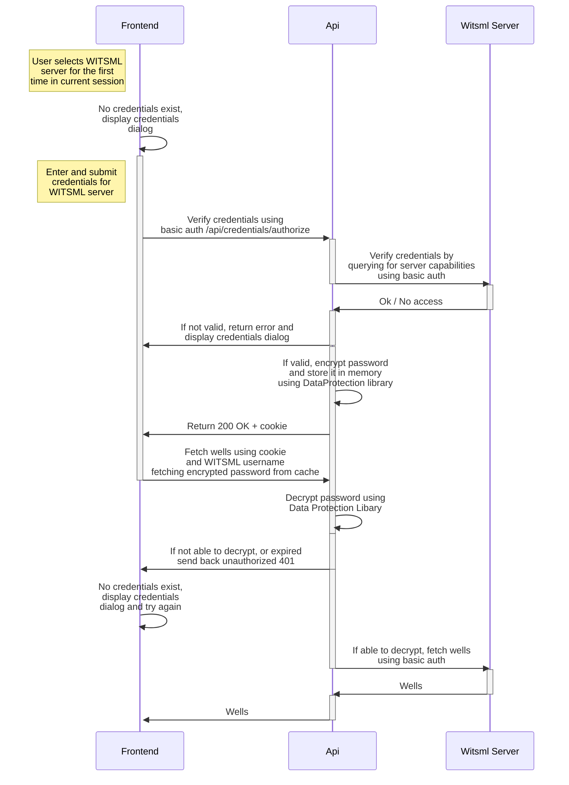

# WITSML server credentials flow (Basic)

Basic mode uses a session cookie to keep track of the user. This mode is used by setting `"OAuth2Enabled": false` in the API configuration (and leaving `VITE_MSALENABLED=` empty in the frontend environment).

This is a description of the flow:
### 1. When the user connects to a server for the first time
  - frontend contacts `authorize` endpoint with entered credentials along with server url
  - if this is a new client without any cookie and id, generate an id for this client
  - backend verifies credentials with the WITSML server
  - verified credentials are added to a <username, encrypted password> dictionary cached under a unique cacheId based on client-id and server host
  - `TTL` before credentials are invalidated will be given by the query param `keep`
    - keep=true => 24 hours
    - keep=false or missing  => 1 hour
  - `[secure ,samesite=strict, httponly]` cookie is added to the response with uuid as value

### 2. Successive connections to API
  - frontend calls API with `WitsmlTargetServer` and `WitsmlTargetUsername` headers
  - API routes that handle two servers include `WitsmlSourceServer` and `WitsmlSourceUsername` headers as well
  - `[secure ,samesite=strict, httponly]` cookie is passed along with the request with id as value
  - backend uses uuid from the cookie to lookup encrypted credentials in `CredentialsCache`
    - if no credentials exists, send response `401`. User will have to login to get a cookie with valid cache entry
  - given that multiple sets of credentials can be saved in the backend for a given server, it is sufficient to change the `WitsmlTargetUsername` (or Source) header to use a different set of credentials
    - in the frontend this can be achieved by clicking on the WITSML username in the top right corner menu, or in the server connections tab



## Swagger
When developing, visit `https://localhost:5001/swagger/index.html` to examine endpoints and authentication schemes. Setup will be outlined below.

The `WitsmlServerHandler` at `/api/witsml-servers` endpoint can be used to get a list of WITSML servers in json format without any credentials.

Steps to use endpoints with `Basic` authentication
1. Authenticate against the WITSML server through the `AuthorizationHandler` endpoint `/api/credentials/authorize`. Url and base64 encoded credentials needs to be provided with the request in the header `WitsmlAuth`. 
2. Now visit any endpoint, e.g. `/api/wells` and provide the same Url in the header `WitsmlTargetServer` (now without credentials), as well as the username in the `WitsmlTargetUsername` header

Further information about the header format is given on the swagger page/endpoint. 

## API Access without frontend

Below are some examples on the use of API endpoints without the frontend. See information about `Swagger` and `Swashbuckle` earlier in the document for detailed information on the endpoints. Examples of accesing the API with a custom client are presented in the [APICLIENT.md document](./APICLIENT.md).

__1. Get witsml-server configuration list__ and cookie. You will need to include this cookie to subsequent calls to the API

```http
GET http://localhost:5000/api/witsml-servers HTTP/1.1
Host: localhost:5000
Content-Type: application/json
Origin: http://localhost:3000
```
```http
HTTP/1.1 200 OK
Set-Cookie: witsmlexplorer=9a8c9c5d-1d0c-4ebf-867d-6641962da380; path=/; secure; samesite=strict; httponly
```

__2. Authorize WITSML credentials__ for the WITSML server you will query, this to ensure that backend encrypts the password and caches it against your session. The WitsmlAuth consists of base 64 encoded `username:password` (in the following example it is `user123:pass456`), and, after the 'at' sign `@`, the WITSML server URL.

```http
GET http://localhost:5000/api/credentials/authorize?keep=false HTTP/1.1
Host: localhost:5000
Content-Type: application/json
Origin: http://localhost:3000
Cookie: witsmlexplorer=9a8c9c5d-1d0c-4ebf-867d-6641962da380
WitsmlAuth: dXNlcjEyMzpwYXNzNDU2@https://witsmlserver.using.basic.creds/Store/WITSML
```
```http
HTTP/1.1 200 OK
Content-Length: 0
Connection: close
Date: Tue, 22 Nov 2022 21:03:00 GMT
Server: Kestrel
Access-Control-Allow-Credentials: true
Access-Control-Allow-Origin: http://localhost:3000
```

__3. Use endpoints__  
Include cookie. If credentials has expired or missing you will get a `401` response and will need to authorize (step 2) again first. `WitsmlTargetServer` and `WitsmlTargetUsername` have to match the information entered in step 2. to correctly use the cached credentials.

```http
GET http://localhost:5000/api/wells HTTP/1.1
Host: localhost:5000
Content-Type: application/json
Origin: http://localhost:3000
Cookie: witsmlexplorer=9a8c9c5d-1d0c-4ebf-867d-6641962da380
WitsmlTargetServer: https://witsmlserver.using.basic.creds/Store/WITSML
WitsmlTargetUsername: user123
```
```http
HTTP/1.1 200 OK
Connection: close
Content-Type: application/json; charset=utf-8
Date: Tue, 22 Nov 2022 20:53:03 GMT
Server: Kestrel
Transfer-Encoding: chunked

[
  {
    "uid": "8b6b40ca-fcf5-4f4c-83ff-91a9f358c30b",
    "name": "_ Complete",
    "field": "Greenfield",
    "timeZone": "+01:00",
    "operator": "Equinor",
...
...
```
