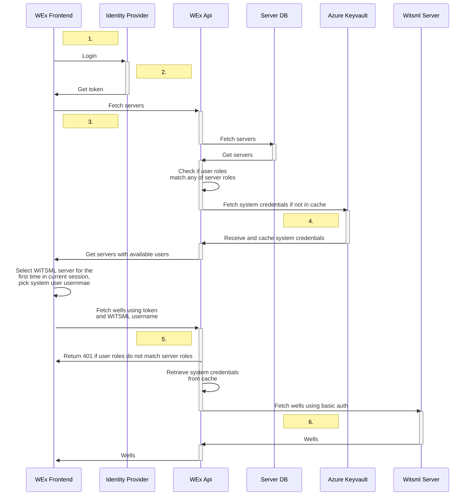
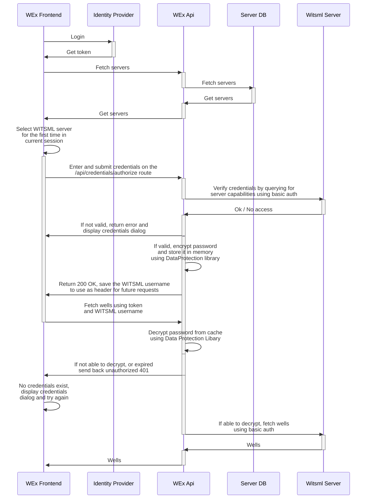

# Authentication and Authorization in WITSML Explorer using OAuth2

OAuth mode uses JWT authentication to keep track of the user. For information about OAuth2 authorization code flow see: [auth code flow](https://learn.microsoft.com/en-us/azure/active-directory/develop/v2-oauth2-auth-code-flow). This mode allows the user to log in with their own credentials, or if roles permit use a `system-user`.

## Configuration

Example `mysettings.json` file for API:

```json
    "OAuth2Enabled": true,
    "AzureAd": {
        "AppName": "witsml-explorer-api",
        "Instance": "https://login.microsoftonline.com/",
        "TenantId": "b3edbf8f-e8b2-4c4e-96fc-c86cdd7fd55f",
        "ClientId": "109e12e2-4ca7-48d0-af05-c834c88ff22c",
        "PolicyRoles": [  "admin", "developer", "employee" ],
        "TokenValidationParameters": {
            "ValidateAudience": false,
            "ValidateIssuerSigningKey": true,
            "ValidateTokenReplay": true
        },
        "Swagger": {
            "AppName": "witsml-explorer-swaggerui",
            "AuthorizationUrl": "https://login.microsoftonline.com/b3edbf8f-e8b2-4c4e-96fc-c86cdd7ed55f/oauth2/v2.0/authorize",
            "TokenUrl": "https://login.microsoftonline.com/b3edbf8f-e8b2-4c4e-96fc-c86cdd7ed55f/oauth2/v2.0/token",
            "ClientId": "5abc9bc0-3ecb-423b-8457-da3c017c547a",
            "Scopes": "api://a10111dc-712d-485f-8600-57be8c597921/access_as_user",
        },
        "KVWitsmlServerCreds": "witsmlexp-servers-kv",
    }
```

Required environment variables in frontend [Dockerfile](../Dockerfile-frontend).

```bash
# To disable MSAL, leave VITE_MSALENABLED empty
VITE_MSALENABLED=true
VITE_AZURE_AD_TENANT_ID=b3edbf8f-e8b2-4c4e-96fc-c86cdd7fd55f
VITE_AZURE_AD_CLIENT_ID=62cd6a0b-f869-0caa-ca95-8d1980fb6f25
VITE_AZURE_AD_URL_WITSMLEXPLORER=http://localhost:3000/
VITE_AZURE_AD_SCOPE_API=api://a10111dc-712d-485f-8600-57be8c597921/access_as_user
```

## System-user credentials

Often users will enter their own credentials to authenticate against a WITSML server. With OAuth mode, it is possible to share `system-user` credentials based on role assignment. For information about app roles, see: [app roles](https://learn.microsoft.com/en-us/azure/active-directory/develop/howto-add-app-roles-in-azure-ad-apps). `System-user` credentials for a server can be included through a `secrets.json` file, or in Azure keyvault.

**secrets.json format**

```json
"WitsmlCreds": {
    "prod":  { "Host": "https://url1", "UserId": "user1", "Password": "pw1" },
    "test":  { "Host": "https://url2", "UserId": "user2", "Password": "pw2" }
}    
```

To use Azure keyvault, create your keyvault (named `witsmlexp-servers-kv` in the example [configuration](#configuration)) and enter your system credentials as secrets in the following format to be included and automatically cached at api startup.

**example keyvault entries**

| Name         | Type      | Status   | Expiration date |
|--------------|-----------|------------|------------|
| witsmlcreds--server1user--host | My server1 prod [R]      |         ||
| witsmlcreds--server1user--password | My server1 prod [R]      |         ||
| witsmlcreds--server1user--userid | My server1 prod [R]      |         ||
| witsmlcreds--server2user--host | My server2 test [CRUD]      |         ||
| witsmlcreds--server2user--password | My server2 test [CRUD]      |         ||
| witsmlcreds--server2user--userid | My server2 test [CRUD]      |         ||

Credentials will be mapped on URL from secrets with the server list. `Server` entry in the database will have the property `roles`. The app role assigned to a server will be compared to the role claims in the JWT provided in the Authorization header. If a user has been assigned the same application role, system credentials will be made available to the user. An API call will use the system credentials if the system username is set in the `WitsmlTargetUsername` or `WitsmlSourceUsername` header.

**example server json in list**

```json
{
    "name": "Equinor WITSML",
    "url": "https://witsml007.someserver/store/WITSML",
    "description": "Equinor testserver. Do not edit any datasets",
    "roles": [ "user" ],
    "credentialIds": []
}
```

**example JWT from Bearer token**

```json
  "roles": [
    "developer",
    "admin",
    "user"
  ]
```

## Sharing system-user credentials across multiple servers

If you have multiple servers using the same credentials, you can configure them once and share them across all relevant servers. This reduces the overhead of maintaining multiple sets of identical credentials.

To share system-user credentials:

1. Create a single set of secrets in Azure Keyvault. The secrets should follow the same naming convention as individual server credentials, even with a valid host. For example, `witsmlcreds--shareduser--host`, `witsmlcreds--shareduser--password`, and `witsmlcreds--shareduser--userid`.
2. While creating or editing a server in Witsml Explorer, set `Credential IDs` to match the credentialID (middle) part in the shared credentials' name. Following the previous example, this should be set to `shareduser`. If you have multiple sets of shared credentials, these can be added: `shareduser shareduser2`.
3. Repeat this process for all servers you want to use `shareduser`.

Note: Only users with the admin role can set or change the `Credential IDs` for a server. Regular users will not be able to modify it.

When a server is queried, the backend will first check if you have a role that overlaps with the server roles. Then, if the credential IDs are set, the backend will use the credential IDs to match credentials from Azure Keyvault. If it is not set, the backend will fetch the server-specific credentials as before.

## System user credentials flow

1. End user visits Witsml Explorer.
2. The end user is redirected to login with OpenID Connect (Azure AD).
3. Witsml Explorer fetches the initial server list from DB. When OAuth2 is enabled both in the frontend and backend, retrieving the server list will only be available for users logged in with OpenID. Similarly Create, Update and Delete of servers will be reserved for users with role `admin`. A list of available WITSML users will be returned for every server. These are previously logged in WITSML users for the given OpenID user and/or a system user.
4. When one of the user roles and server roles overlap, the backend fetches system credentials from `Azure Keyvault` for this witsml server.
5. The user queries a server with an available system user, by specifying them respectively in the `WitsmlTargetServer` and `WitsmlTargetUsername` headers. API routes that handle two servers include `WitsmlSourceServer` and `WitsmlSourceUsername` headers as well. The backend will check the received `Bearer` JWT token for `app-roles`. This in turn will be checked against the configured `roles` for the server to retrieve the system credentials.
6. The server will now forward the query to the witsml server using `Basic` authorization with system credentials fetched from step 4. The resulting list of wells will then be passed back to the frontend.



## Flow with entered credentials



## Swagger

When developing, visit `https://localhost:5001/swagger/index.html` to examine endpoints and authentication schemes. OAuth mode requires a configuration matching your own Azure app registration as shown in the [Configuration section](#configuration). All endpoints will need a logged in user, authenticated by your tenant.

The `WitsmlServerHandler` at `/api/witsml-servers` endpoint can be used to get a list of witsml servers in json format without any WITSML credentials.

Steps to use endpoints:

1. Authorize with the tenant.
2. Authenticate against the WITSML server through the `AuthorizationHandler` endpoint `/api/credentials/authorize`. Url and base64 encoded credentials needs to be provided with the request in the header `WitsmlAuth`.
3. Now visit any endpoint, e.g. `/api/wells` and provide the same Url in the header `WitsmlTargetServer` (now without credentials), as well as the username in the `WitsmlTargetUsername` header.

When using a system user, the second step can be omitted.

Further information about the header format is given on the swagger page/endpoint.

## API Access without frontend

Below are some examples on the use of API endpoints without the frontend. See information about `Swagger` and `Swashbuckle` earlier in the documents for detailed information on the endpoints. Examples of accesing the API with a custom client are presented in the [APICLIENT.md document](./APICLIENT.md).

**1. witsml-server configuration list** (and other endpoints)

No cookie involved. But you will still need to authorize for servers configured as `Basic`.

**Prerequisite**: a valid `Bearer` token with app-roles and server configuration in place.

```http
GET https://localhost:5001/api/witsml-servers HTTP/1.1
Content-Type: application/json
Authorization: Bearer eyJ...<token here>
```

**2. Use endpoints**

If a server has system credentials in keyvault and the bearer of the token has the correct `role` for this server, you can use endpoints directly. Example below for rigs

```http
GET http://localhost:5000/api/wells/<wellId>/wellbores/<wellboreId>/rigs HTTP/1.1
Authorization: Bearer eyJ...<token here>
Content-Type: application/json
WitsmlTargetServer: https://witsmlserver.using.system.creds/store/WITSML
WitsmlTargetUsername: system-user123
```

**3. Authorize WITSML credentials**

If you do not have system credentials in keyvault and need to use Basic credentials, you must `authorize` first like below before using endpoints with the given server.

```http
GET http://localhost:5000/api/credentials/authorize?keep=false HTTP/1.1
Authorization: Bearer eyJ...<token here>
Host: localhost:5000
Content-Type: application/json
Origin: http://localhost:3000
WitsmlAuth: dXNlcjEyMzpwYXNzNDU2@https://witsmlserver.using.basic.creds/Store/WITSML
```

(note the base64 encoded `username:password` @ witsmlserver)
