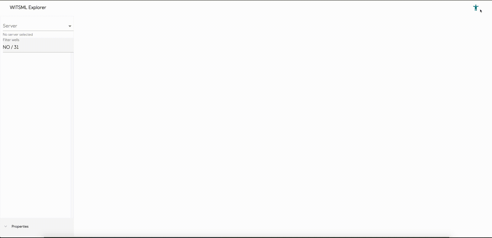

# Witsml Explorer
  

Witsml Explorer is a data management tool used for browsing and editing data directly on [WITSML](https://en.wikipedia.org/wiki/Wellsite_information_transfer_standard_markup_language) servers.

## Key features
* Runs directly in your browser, no need to install additional software.
* An intuitive and easy to use interface.
* Connect to any WITSML server running version 1.4.1.1.
* Supported WITSML objects includes: wells, wellbores, log objects, curves, trajectories, trajectory stations and rigs.
* Trim log objects and individual curves.
* Copy log objects and individual curves (also between different servers!).
* Deep linking directly to objects using the URL

## Witsml as a Nuget package
Please see [nuget.md](/nuget_witsml.md)

## Contributing
Please see our [contributing.md](/CONTRIBUTING.md).

## Community
Please read and respect the [CODE OF CONDUCT](/CODE_OF_CONDUCT.md)

## License
Witsml Explorer has the Apache-2.0 license.
